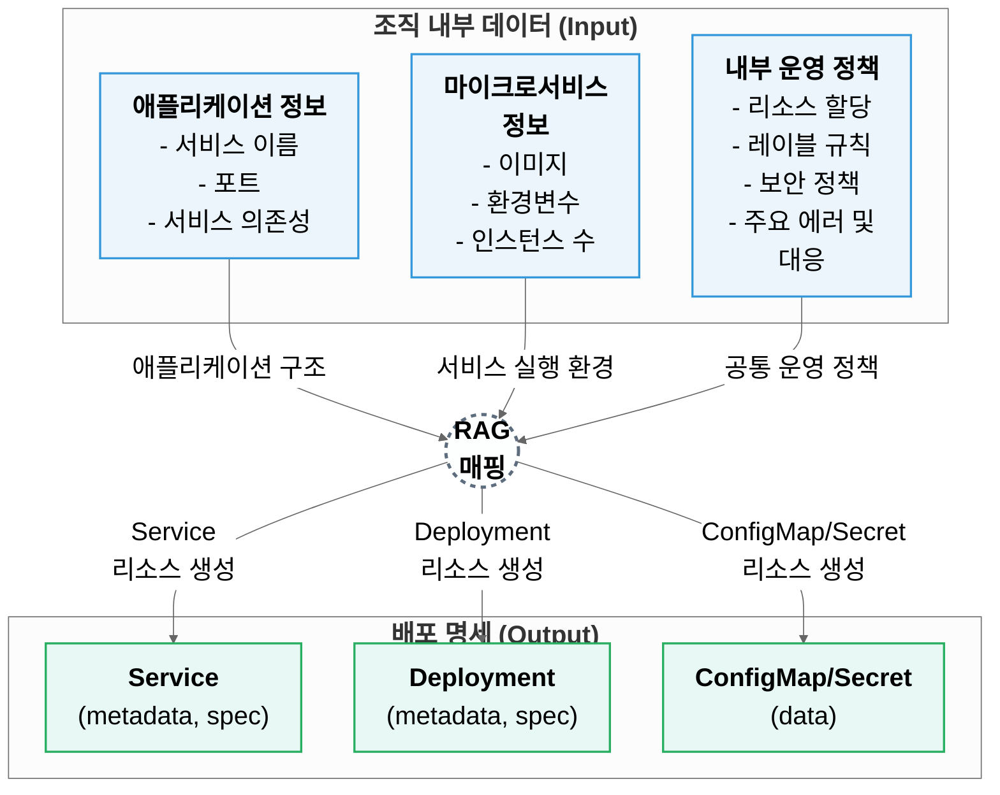
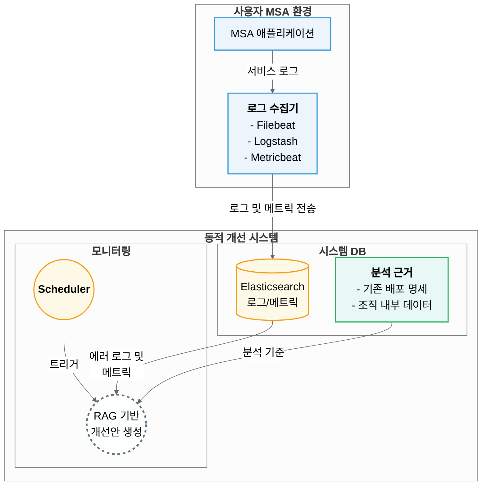
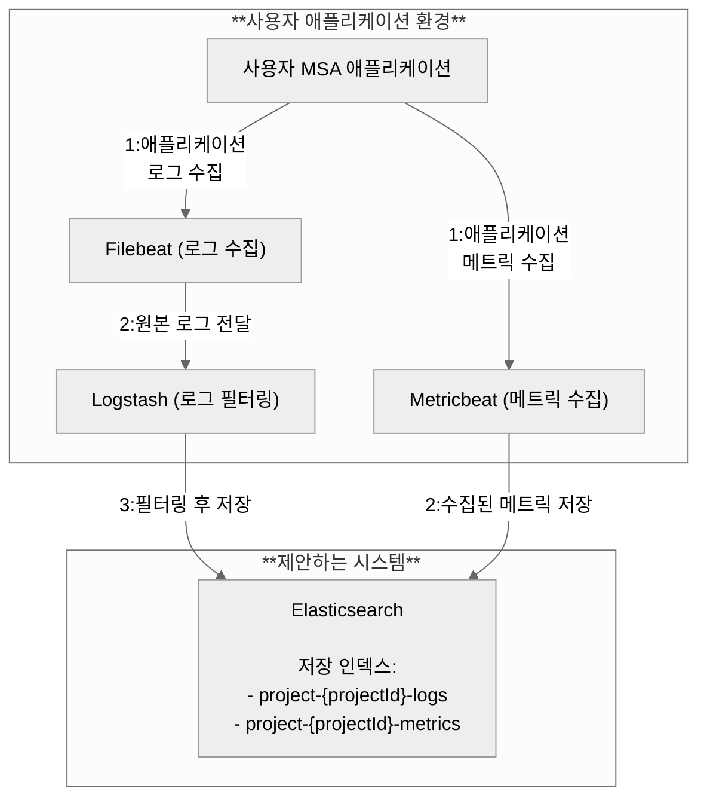
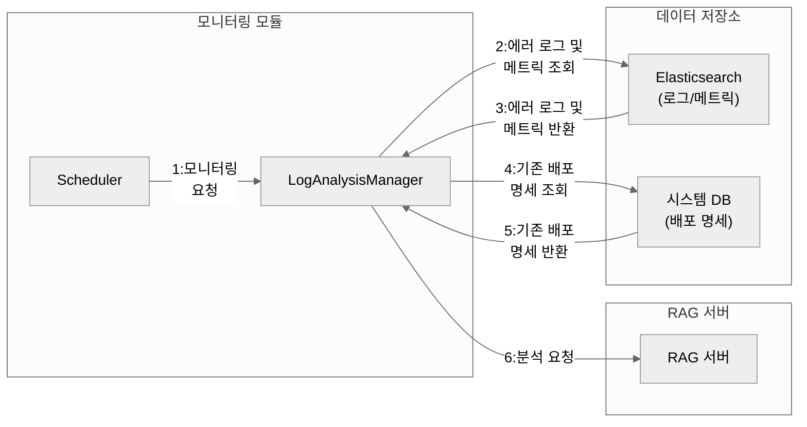
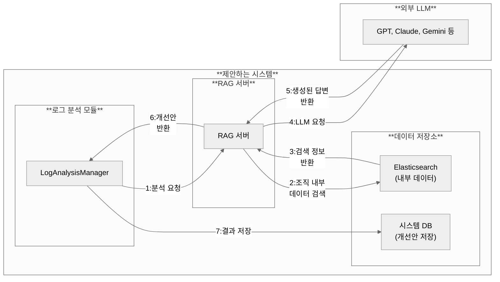

### 1. 프로젝트 배경
#### 1.1. 국내외 시장 현황 및 문제점

 최근 IT 시장의 중심에는 대규모 언어 모델(LLM)과 MSA(Microservice Architecture)가 있습니다. 조사(Menlo, Hostinger, The Business Research Company)에 따르면 기업의 시스템 운영을 위한 LLM과 MSA의 도입은 계속 증가하는 추세로 2026년도에는 각각 도입비율과 시장규모가 80%와 80억 달러를 넘길 것으로 추정된다고 합니다. 이러한 흐름은 기업의 운영 방식의 변화를 만들어내고 있습니다. 
 MSA는 기존 모놀리식 구조와 대비되는 개념으로, 시스템을 독립적인 기능 단위로 분리하여 유연하고 확장 가능한 애플리케이션을 구축하는 시스템 아키텍쳐입니다. 이러한 구조적 특성상 MSA는 모놀리식에 비해 확장성이 높다는 장점이 있지만 규모가 확장될수록 복잡한 구조를 띄게 되어 시스템 배포에 필요한 배포 명세 작성과, 운영 복잡성이 증가한다는 문제가 있습니다.
 MSA 환경을 컨테이너 기반(예: Kubernetes)으로 운영하는 데에는 다음과 같은 문제점들이 존재합니다.

- **조직 내부 데이터를 반영한 배포 명세 생성의 어려움** : MSA 배포 명세에는 조직의 고유한 정책, 서비스 간 의존성, 보안 설정 등 내부 데이터가 정확히 반영되어야 합니다. 하지만 이 데이터는 외부 도구에서 접근하기 어렵고, 프로젝트 상황에 따라 계속 변경되기 때문에 배포 담당자가 모든 정보를 숙지하기 어렵습니다.

- **LLM을 활용한 기존 접근 방법의 한계로 인한 문제** : 기존의 LLM을 활용한 접근 방식인 Fine-tuning은 특정 도메인에 특화된 모델을 이용할 수 있다는 장점이 있지만, 새 데이터마다 재학습이 필요해 시간, 비용 부담과 반영 지연이 발생합니다. 또한 생성된 답변의 출처를 제시하지 못하기 때문에 신뢰성이 중요한 배포 명세 작성 지원에 적합하지 않습니다.

- **오류 로그 및 리소스 사용량을 반영한 배포 명세 개선 기능 부재** : 기존 시스템들(예: Prometheus, Grafana 등)은 대부분 리소스 상태 진단 기능은 제공하지만, 운영 중 수집되는 마이크로서비스의 에러 로그와 같은 운영 정보나 CPU/메모리 사용량 등의 리소스 메트릭을 반영하여 배포 명세의 구체적인 개선 방법을 제공하는 기능은 제공하지 않습니다.

#### 1.2. 필요성과 기대효과
RAG(Retrieval-Augmented Generation) 기술을 활용해서 컨테이너 기반 마이크로서비스의 운영 환경 관리 지원 시스템을 구축함으로써, 기존의 문제점을 해결하고 다음과 같은 기대 효과를 얻을 수 있습니다.

- **배포 정확도 및 효율성 향상** : 사용자 요구사항에 맞는 조직 내부 데이터를 반영해서 정확하고 일관된 배포 명세를 생성함으로써, 수작업으로 인한 오류를 줄이고 배포 준비 시간을 단축합니다.
- **운영 환경 안정성 확보** : 운영 환경에서 수집된 로그와 리소스 메트릭을 조직 내부 데이터를 기반으로 배포 명세 개선안을 제안함으로써, 서비스의 안정성을 높이고 인프라 자원의 낭비를 줄일 수 있습니다.

### 2. 개발 목표
#### 2.1. 목표 및 세부 내용
> 목표 
- 배포 명세 작성을 위한 조직 내부 데이터의 정의와 분류 기준 제시 
- RAG 기반 배포 명세 생성·수정 기능을 제공하는 MSA 운영 지원 시스템 구축 
- 컨테이너 에러 로그 및 리소스 메트릭 수집을 통한 배포 명세 동적 개선 방안 제시 및 기술 구현 

> 세부 구현 내용
- **조직 계정 및 프로젝트 관리**: JWT 기반의 안전한 사용자 인증 및 MSA 애플리케이션 단위의 프로젝트 생성, 원격 접속, 관리 기능.
- **조직 내부 데이터 관리**: 조직의 정책, MSA 정의 문서 등을 업로드하면 자동으로 텍스트를 추출하고 벡터 임베딩하여 Elasticsearch에 저장하는 기능.
- **RAG 기반 배포 지원**: 사용자의 자연어 질의를 분석하고, Elasticsearch에 저장된 내부 데이터를 검색하여 컨텍스트를 구성한 뒤, LLM을 통해 배포 명세를 생성하거나 오류를 수정하는 기능.
- **서비스 운영 모니터링**: 로그 수집기(Filebeat, Metricbeat 등)를 사용자 환경에 쉽게 배포하고, 수집된 에러 로그와 리소스 메트릭 정보를 주기적으로 조회해서 배포 명세 개선안을 생성 및 제공하는 기능.

#### 2.2. 기존 서비스 대비 차별성 
| 평가 기준 | 제안 시스템 | 기존 접근법 (파인튜닝) |
| :--- | :--- | :--- |
| **최신 데이터 반영 수준** | 높음 (문서 추가/수정만으로 즉시 반영 가능) | 고정적 (전체 모델 재학습 필요) |
| **데이터 처리 및 운영 효율성** | 높음 (벡터 임베딩만 재수행하여 비용 및 시간 효율적) | 낮음 (재학습에 막대한 시간과 컴퓨팅 자원 소요) |
| **근거 추적 가능성** | 가능 (답변 생성에 참조한 실제 문서를 제시하여 신뢰성 확보) | 불가능 (지식이 모델 파라미터에 내재화되어 근거 추적 불가) |

또한, 기존 모니터링 도구가 단순히 보여주는 것에 그쳤다면, 본 시스템은 수집된 데이터를 바탕으로 조직 정책을 해석하여 배포 명세를 능동적으로 개선 및 제안한다는 점에서 차별화됩니다.

#### 2.3. 사회적 가치 도입 계획 
- **기술 장벽 완화**: 복잡한 MSA 및 Kubernetes 운영에 대한 기술적 장벽을 낮춤으로써, 소규모 팀이나 학생, 신입 개발자도 표준화된 방식으로 안정적인 인프라를 운영할 수 있도록 지원합니다.

### 3. 시스템 설계
#### 3.1. 시스템 구성도


- 조직 내부 데이터를 활용한 배포 명세 생성 과정



- RAG 기반 운영 개선 구조도


- 로그 수집 과정


- 로그 분석 요청



- 개선안 생성 및 저장 과정


#### 3.2. 사용 기술
| 구분 | 기술 스택 |
| :--- | :--- |
| **소프트웨어 형상관리 (SCM)** | Github |
| **컨테이너 기술** | Docker |
| **컨테이너 오케스트레이션** | Kubernetes |
| **Back-end** | Spring Boot (3.5.3), Flask (3.1.1), Java (21), Python (3.11) |
| **Front-end** | HTML, CSS, JavaScript, Thymeleaf |
| **RAG** | LangChain (0.3.27) |
| **로그 수집** | Elasticsearch (8.13.4), Logstash (7.17.9), Filebeat (7.17.9), Metricbeat (7.17.9) |

### 4. 개발 결과
#### 4.1. 전체 시스템 흐름도
사용자는 시스템에 로그인하여 프로젝트를 생성하고, 해당 프로젝트에 조직 내부 데이터를 업로드합니다. 업로드된 문서는 Flask 서버에서 벡터화하여 Elasticsearch에 저장됩니다. 그 후 사용자는 채팅 인터페이스를 통해 자연어로 배포 명세 생성을 요청할 수 있습니다.

**RAG 기반 배포 명세 생성 흐름**:
1. **사용자 질의 입력**: 사용자가 배포하고자 하는 MSA의 기능 흐름과 서비스 목록을 포함하여 자연어로 요청합니다. (예: 선물하기 서비스를 구축하려고 하거든? 실제 배포가 가능해야 할 텐데 유저 등록, 관리도 가능해야 하고 상품 조회, 사용자 위시리스트 조회랑 주문하기, 주문하기 시 카카오 메시지로 메시지 보내는 것까지 기능적으로 가능해야 해. 이걸 구현하려면 user-service, product-service, wish-service, order-service, gift-service, api-gateway가 모두 필요해. 그러려면 배포 파일을 어떻게 구성해야 할까?)
2. **유사도 검색 (Retrieve)**: 시스템은 사용자 질의를 임베딩하여 Elasticsearch에 저장된 문서 벡터 중 가장 관련성 높은 문서 청크(컨텍스트)를 검색합니다.
3. **프롬프트 구성 (Augment)**: 검색된 컨텍스트와 원본 사용자 질의, 그리고 사전에 정의된 프롬프트 템플릿을 조합하여 LLM에게 전달할 최종 프롬프트를 구성합니다.
4. **생성 (Generate)**: 최종 프롬프트를 외부 LLM에 전달하여, 조직 내부 데이터가 반영된 Kubernetes YAML 형식의 최종 답변을 생성합니다. 생성된 내용은 사용자에게 표시되고, 시스템 DB에 이력으로 저장됩니다.

#### 4.2. 기능 설명 및 주요 기능 명세서
**RAG 기반 MSA 애플리케이션 배포 지원**
- **설명**: 사용자가 자연어로 서비스 구성에 대해 설명하면 조직 내부 데이터를 근거로 Kubernetes 배포 명세(YAML)를 생성합니다. 필수 필드 누락이나 운영 정책 위반 등의 오류가 포함된 기존 명세를 업로드하고 수정을 요청할 수도 있습니다.

- **입력**: 사용자 자연어 질의, (선택) 기존 배포 명세 파일.

- **출력**: 주석이 포함된 Kubernetes YAML 배포 명세, 생성 근거가 된 조직 내부 데이터 출처.

**서비스 운영 모니터링 및 동적 개선**
- **설명**: 사용자의 MSA 환경에 로그 수집기(Filebeat, Metricbeat 등) 배포 파일을 제공합니다. 수집된 에러 로그나 리소스 메트릭(CPU, 메모리 사용량)을 주기적으로 분석하고, 이를 조직 내부 정책(예: 리소스 할당 기준, 주요 에러 해결 방안)과 비교하여 최적화된 배포 명세 개선안을 생성하여 사용자에게 제안합니다.

- **입력**: Elasticsearch에 수집된 에러 로그 및 리소스 메트릭, 사용자가 업로드한 기존 배포 명세.

- **출력**: 리소스 할당량 조정 등이 반영된 배포 명세 개선안 YAML 파일.

#### 4.3. 디렉토리 구조
    .
    ├── triton_dashboard  # Spring Boot 메인 서버
    │   ├── src
    │   │   ├── main
    │   │   │   ├── java
    │   │   │   └── resources
    │   │   │       ├── static
    │   │   │       ├── templates
    │   │   │       └── application.yml
    │   ├── build.gradle
    │   └── Dockerfile
    ├── rag_server   # Flask RAG 서버
    │   ├── app
    │   │   ├── __init__.py
    │   │   ├── main.py
    │   │   ├── …
    │   ├── requirements.txt
    │   └── Dockerfile
    ├── docs           # 프로젝트 문서
    └── docker-compose.yml # Elasticsearch 등 실행 환경 구성

#### 4.4. 산업체 멘토링 의견 및 반영 사항
> 멘토 피드백과 적용한 사례 정리
멘토 의견
- “사용자 이해도 부족”을 어떤 수준/사용자군을 대상으로 하는지 구체화 필요.
- 동적 운영 정보의 범주(수집 항목·주기·출처)와 이를 바탕으로 어떤 지원을 어떻게 제공할지 구체화 필요.
- 설계 단계에서 클래스 간 관계/책임을 더 명확히 표현 권장.
- 시퀀스 다이어그램에 “RAG 기반 응답 생성”의 기술적 흐름(검색→재랭킹→프롬프트→생성→후처리)을 추가하면 신뢰도와 이해도 제고 가능.
- 최종 단계에서는 핵심 데이터와 동적 운영 정보를 명확히 정의하고, 텍스트 이상의 운영 적용 결과물 및 검증 방법(실험 설계·지표)을 제시할 것.


> 반영 사항/계획

- 사용자군을 초급/중급/고급 등 숙련도 기준으로 세분화하고 문제정의에 반영
- 동적 운영 정보의 스키마/수집원/갱신주기를 정의하고 설계서에 명시.
- 클래스 다이어그램에 책임/의존 방향을 보강하고, 핵심 모듈 간 인터페이스 명세 추가.
- “RAG 기반 응답 생성” 시퀀스 다이어그램 상세화(질의→리트리버→재랭킹→컨텍스트 구성→프롬프트→생성→근거출력).
- 최종 산출물로 배포 템플릿/파라미터 추천안/운영 체크리스트를 제시하고, 검증 지표(배포 성공률, MTTR, 비용절감률 등)와 실험 시나리오를 함께 제시


### 5. 설치 및 실행 방법
#### 5.1. 설치절차 및 실행 방법
> Docker 및 Git 사전 설치가 필요합니다.
- git clone
```bash
git clone https://github.com/pnucse-capstone2025/Capstone-2025-team-14.git 
```
- .env 파일 생성
  - 설치 환경에서 사용할 변수를 다음 경로에 .env 파일로 저장합니다.
> rag_server/.env
```.env
OPENAI_API_KEY=""
ELASTICSEARCH_URL=""

# LangSmith 
LANGSMITH_TRACING=""
LANGSMITH_ENDPOINT=""
LANGSMITH_API_KEY=""
LANGSMITH_PROJECT=""
```

> triton_dashboard/.env
```.env
DB_URL=""
DB_USERNAME=""
DB_PASSWORD=""

JWT_SECRET=""
JWT_TOKEN_TIMEOUT_SEC=""
JWT_REFRESH_TOKEN_TIMEOUT_SEC=""

RAG_SERVICE_URL=""

ELASTICSEARCH_HOST=""
ELASTICSEARCH_PORT=""

API_KEY_ENCRYPTION_PASSWORD=""
API_KEY_ENCRYPTION_SALT=""
```

- docker-compose 실행
```bash
docker-compose up -d --build
```


#### 5.2. 오류 발생 시 해결 방법

- JWT Secret 키 관련 오류 시 키 길이가 64자 이상인지 체크해야 합니다. 
- Elasticsearch 접속 오류 발생 시 유효한 환경변수인지 점검해야 합니다.

### 6. 소개 자료 및 시연 영상
#### 6.1. 프로젝트 소개 자료

[발표자료 (PDF)](/docs/03.발표자료/트리톤%20발표%20자료.pdf)

#### 6.2. 시연 영상
> 영상 링크 또는 주요 장면 설명

### 7. 팀 구성
#### 7.1. 팀원별 소개 및 역할 분담

- 김휘수, whisu20000@pusan.ac.kr
  - RAG 파이프라인 구축
  - LangSmith를 활용한 체인 실행 흐름 모니터링 및 디버깅
  - RAG 서버 구축
- 신세환, sk124590@gmail.com 
  - 실시간 웹 터미널 구현
  - 로그 수집기 배포 기능 개발
  - 조직 내부 데이터 정의
  - 서비스 모니터링 기능 개발
  - 테스트용 MSA 애플리케이션 개발
- 설종환
  - RAG 채팅 클라이언트 및 채팅 이력 관리 기능 개발
  - 조직 내부 데이터 저장 및 삭제 구현
  - 테스트용 MSA 애플리케이션 개발
  - 정량 평가 연구 진행

### 8. 참고 문헌 및 출처

1. J. Lewis and M. Fowler, (2014). Microservices [Online]. Available: https://martinfowler.com/articles/microservices.html (downloaded 2025, Sep. 17)
2. Microsoft, (2025). Microservices architectural style [Online]. Available: https://learn.microsoft.com/en-us/azure/architecture/guide/architecture-styles/microservices (downloaded 2025, Sep. 19)
3. Hostinger, (2025). LLM statistics 2025: Comprehensive insights into market trends and integration [Online]. Available: https://www.hostinger.com/tutorials/llm-statistics (downloaded 2025, Sep. 17)
4. P. Lewis, E. Perez, A. Piktus, F. Petroni, V. Karpukhin, N. Goyal, H. Küttler, M. Lewis, W. Yih, T. Rocktäschel, S. Riedel, and D. Kiela, "Retrieval-augmented generation for knowledge-intensive NLP tasks," Advances in Neural Information Processing Systems, Vol. 33, pp. 9459-9474, 2020.
5. Y. Gao, Y. Xiong, X. Gao, K. Jia, J. Pan, Y. Bi, Y. Dai, J. Sun, and H. Wang, "Retrieval-Augmented Generation for Large Language Models: A Survey," arXiv preprint arXiv:2312.10997, 2023.
6. Atlassian, (2023). DORA Metrics: How to Measure DevOps Performance [Online]. Available: https://www.atlassian.com/devops/frameworks/dora-metrics (downloaded 2025, Sep. 17)
7. D. Merkel, "Docker: lightweight linux containers for consistent development and deployment," Linux journal, Vol. 2014, No. 239, p. 2, 2014.
8. A. Verma, L. Pedrosa, M. R. Korupolu, D. Oppenheimer, E. Tune, and J. Wilkes, "Large-scale cluster management at Google with Borg," Proc. of the Tenth European Conference on Computer Systems (EuroSys '15), 2015.
9. J. Wang, W. Wang, J. Li, R. Wang, and Z. Lin, "A comprehensive survey on approximate nearest neighbor search," ACM Computing Surveys (CSUR), Vol. 54, No. 6, pp. 1-39, 2021.
10. M. Yin, D. Wang, C. Li, Z. Wang, Y. Wang, Z. Liu, H. Liu, J. Wang, T. Wang, J. Lou, W. Dou, and Y. Li, "A Survey on LLM-based Autonomous Agents," arXiv preprint arXiv:2308.11432, 2023.
11. S. Newman, Building Microservices: Designing Fine-Grained Systems, O'Reilly Media, Inc., 2015.
12. The Kubernetes Authors, "Objects In Kubernetes," [Online]. Available: https://kubernetes.io/ko/docs/concepts/overview/working-with-objects/ (downloaded 2025, Sep. 17)
13. P. Liu, W. Yuan, J. Fu, Z. Jiang, H. Hayashi, and G. Neubig, "Pre-train, prompt, and predict: A systematic survey of prompting methods in natural language processing," ACM Computing Surveys, Vol. 55, No. 9, pp. 1-35, 2023.
14. D. Kim, D. Yun, J. Park, and K. Yeom, "A Script Generation Method for Microservice Deployment in a Container Orchestration Environment," Journal of KIISE, Vol. 46, No. 7, pp. 682-689, 2019.
