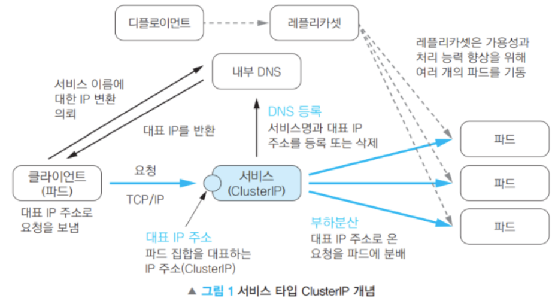
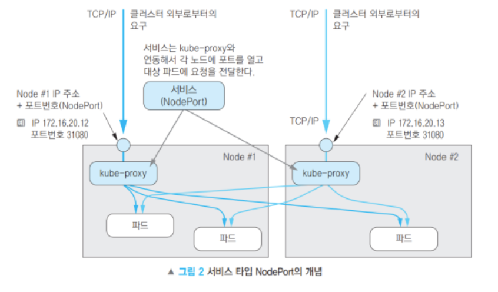
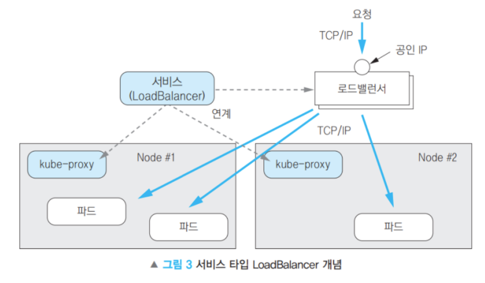
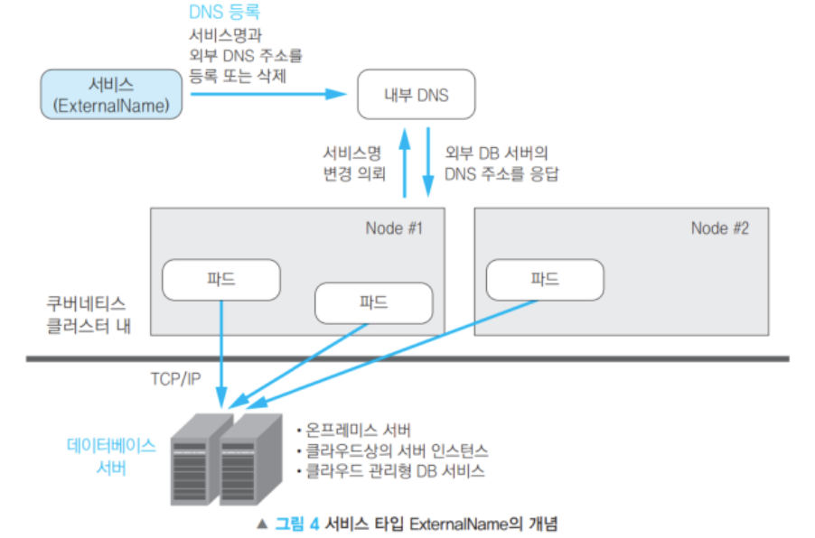
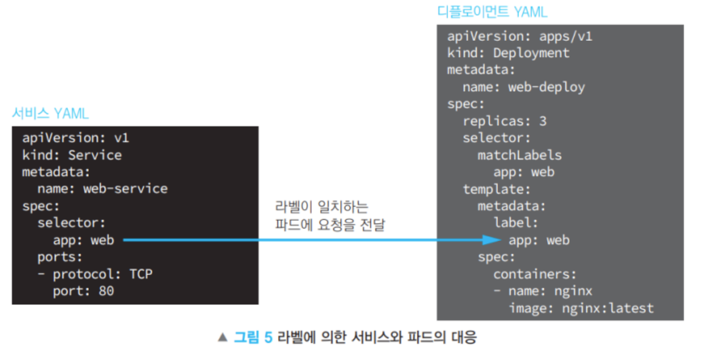
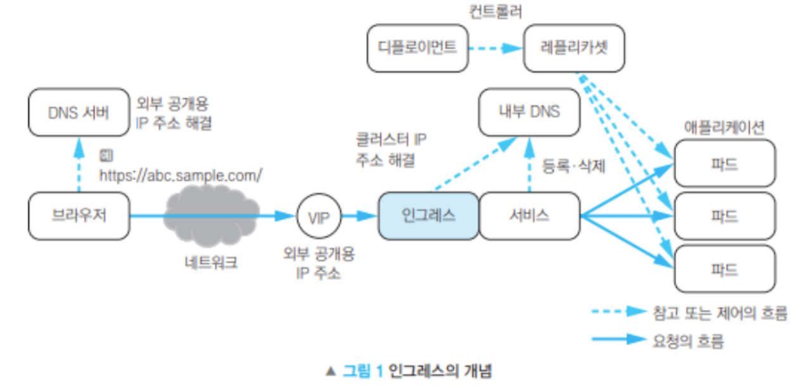

# 쿠버네티스 오브젝트 이해하기

## 쿠버네티스 오브젝트 기술하기

쿠버네티스에서 오브젝트를 생성할 때, 이름 등의 오브젝트에 대한 기본적인 정보와 의도된 상태를 기술한 spec을 제시해야 한다.

### 요구되는 필드

- apiVersion 
이 오브젝트를 생성하기 위해 사용하고 있는 쿠버네티스 API 버전이 어떤 것인지
- kind 
어떤 종류의 오브젝트를 생성하고자 하는지
- metadata 
이름 , UID, (선택)네임스페이스를 포함하여 오브젝트를 유일하게 결정하기 위한 데이터
- spec 
오브젝트에 대해 어떤 상태를 의도하는지
    - spec에 대한 정확한 포맷은 모든 쿠버네티스 오브젝트마다 ㄷ르다.

# 오브젝트 이름과 ID
클러스터의 각 오브젝트는 해당 유형의 리소스에 대해 고유한 이름을 가지고 있다. 또한 모든 쿠버네티스 오브젝트는 전체 클러스터에 걸쳐 고유한 UID(오브젝트를 중복 없이 식별하기 위해 쿠버네티스 시스템이 생성하는 문자열)를 가지고 있다.

- e.g. 이름이 myapp-1234인 파드는 동일한 네임스페이스 내에서 하나만 존재할 수 있지만, 이름이 myapp-1234인 파드와 디플로이먼트는 각각 존재할 수 있다.

- 유일하지 않은 사용자 제공 속성의 경우 쿠버네티스는 레이블과 어노테이션을 제공한다.

# 레이블과 셀렉터

레이블 - 파드와 같은 오브젝트에 첨부된 키와 값의 쌍이다. 레이블은 오브젝트의 특성을 식별하는 데 사용되어 사용자에게 중요하지만, 코어 시스템에 직접적인 의미는 없다.

## 레이블 셀렉터
이름, UID와는 다르게 레이블은 고유한 값이 아니다. 일반적으로 많은 오브젝트에 같은 레이블을 가진다.

레이블 셀렉터로 클라이언트와 사용자는 오브젝트를 식별할 수 있다.

### 일치성 기준 요건
레이블의 키와 값으로 필터링을 적용한다.

```
environment = production
tier != frontend
```
1. environment를 키로, production을 값으로 가지는 모든 리소스
2. tier 키로 가지고 값이 frontend가 아닌 모든 리소스

- 다음과 같이 파드가 노드를 선택하는 기준을 지정해 줄 수 있다.
```
nodeSelector:
    accelerator: nvidia-tesla-p100
```

# 네임스페이스

단일 클러스터 내에서의 리소스 그룹 격리 기능을 제공한다. 리소스의 이름은 네임스페이스 내에서 유일해야 한다.

대부분의 쿠버네티스 리소스(파드, 서비스, 레플리케이션 컨트롤러 외)는 네임스페이스에 속하지만, 네임스페이스 리소스 자체는 네임스페이스에 속하지 않는다.
노드, 퍼시스턴트 볼륨 등 저수준 리소스도 마찬가지이다.

# 어노테이션?

# 컨트롤러 리소스
kubernetes에서 시스템이 원하는 상태를 유지하도록 관리하는 자동화된 관리자.

지속적으로 상태를 관찰하고 원하는 상태와 실제 상태가 다른 경우 자동으로 조정하는 리소스이다.

## 대표적인 컨트롤러 리소스들

- Deployment
일반적인 애플리케이션 배포에 사용
- StatefulSet
상태를 가지는 앱(DB, Kafka 등)용. 고유한 이름, 순서, 스토리지 유지
- DaemonSet
모든 노드에 하나씩 Pod를 배포. 로그 수집, 모니터링용 에이전트 등에 사용
- ReplicaSet
지정된 수의 복제본 유지. Deployment 내부적으로 사용
- Job /CronJob
일회성 작업이나 정기 작업 수행

# 권장 레이블
쿠버네티스 오브젝트를 시각화하고 관리하기 위해서 공통 레이블 셋을 정하고 관리하면 모든 도구들이 이해할 수 있는 공통 방식으로 오브젝트를 식별하고 도구들이 상호 운용적으로 작동할 수 있다.

# 서비스 종류 - 클러스터 네트워킹

- 고도로 결합된 컨테이너 간의 통신: localhost 통신
- 파드 간 통신 : ClusterIP로 해결
- 파드와 서비스 간 통신 : 서비스(ClusterIP, NodePort) 활용
- 외부와 서비스 간 통신 : NodePort, LoadBalancer, Ingress 사용

## ClusterIP : 클러스터 내부 전용


- 내부의 다른 Pod에서만 접근 가능
- 서비스 타입을 명시하지 않으면 > ClusterIP로 만들어진다.
    - spec.type 설정이 없으면 Default로 ClusterIP를 사용한다.


```
apiVersion: v1
kind: Service
metadata:
    name: myservice  # Service 이름 (kubectl get svc myservice로 조회 가능)
  # namespace: default  # 네임스페이스에 생성 : 설정 없으면 'default'
  labels:
    hello: world  # Service에 'hello: world' 라벨 부여
spec:
  ports:
    - port: 8080  # Service가 노출하는 포트 (ClusterIP 기준)
      protocol: TCP
      targetPort: 80  # 실제 Pod 내부에서 실행 중인 컨테이너의 포트 (nginx의 기본 포트 80)
  selector:
    run: mynginx  # 이 Service가 라우팅할 Pod 선택 (라벨 'run=mynginx'인 Pod과 연결)
```

## NodePort : 클러스터 내부 + 외부
- Cluster IP의 기능에 더해진 것
- 공개 포트가 오픈된다. (30000~32767)
- 각 노드가 수령한 요청은 대상 파드들에 부하분산된다 (정식서비스에 사용하는 것은 비추천)
- 외부에서도 각 노드의 IP/특정 포트로 접근 가능
- 내부적으로도 각 Worker 노드 간에 통신할 수 있다.



## LoadBalancer : 클러스터 내부 + 외부 (대표 IP 제공)
- 로드밸런서[ALB, NLB]와 연동 > 외부에 공개
- 로드밸런서는 NodePort를 사용하기에 ClusterIP도 자동할당된다.
- 퍼블릭 클라우드(e.g. AWS)에서 제공되는 로드밸런서와도 연동 가능하다
    - ALB로 들어온다.



## ExternalName : 외부 서비스 연결

- 외부의 엔드포인트에 접속하기 위한 이름 해결
- 퍼블릭 클라우드의 DB나 외부 API 서비스등을 접근할 때 사용
- 서비스의 이름과 외부 DNS의 이름의 매핑을 내부 DNS에 설정
    - 외부 엔드포인트에 접근 가능
    - 포트까지 지정은 불가능



## 서비스와 파드의 연결



- 서비스는 셀렉터와 라벨을 이용해서 특정 파드에 트래픽을 보낸다.
- 서비스가 자동으로 환경 변수를 설정해서 컨테이너에서 쉽게 접근 가능하다
- 부하 분산 기능이 기본적으로 제공된다.

> ClusterIP는 기본값이고, 외부 접근이 필요하면 "NodePort"또는 "LoadBalancer"를 사용해야 한다.

## 인그레스 (Ingress) : 외부와 서비스 간 통신

- 쿠버네티스 클러스터 내부의 서비스(Service)와 외부 트래픽을 연결해준다.
    - 파드에서 실행 중인 애플리케이션을 클러스터 외부에서 접근할 수 있다.
- 로드밸런싱, HTTPS 적용, 도메인 기반 호스팅 등 다양한 기능 제공
- 기존의 로드밸런서를 대체할 수 있다.
    - 하나의 엔드포인트로 여러 서비스에 접근 가능하다.



## 공개 URL과 애플리케이션 매핑
- Ingress는 외부에서 들어오는 URL 요청을 내부 애플리케이션(서비스/파드)로 매핑하는 역할을 수행한다.
- 도메인 기반 라우팅을 지원하며, 여러 애플리케이션을 하나의 Ingress 리소스에서 관리 가능하다.

## 참고한 목록
- [쿠버네티스 공식문서](https://kubernetes.io/ko/docs/concepts/overview/working-with-objects/kubernetes-objects/)
- [Kubernetes 개념 끝내기](https://jinhos-devlog.tistory.com/entry/%ED%8F%AC%EC%8A%A4%ED%8C%85-%ED%95%98%EB%82%98%EB%A1%9C-Kubernetes-%EA%B0%9C%EB%85%90-%EB%81%9D%EB%82%B4%EA%B8%B0-1)