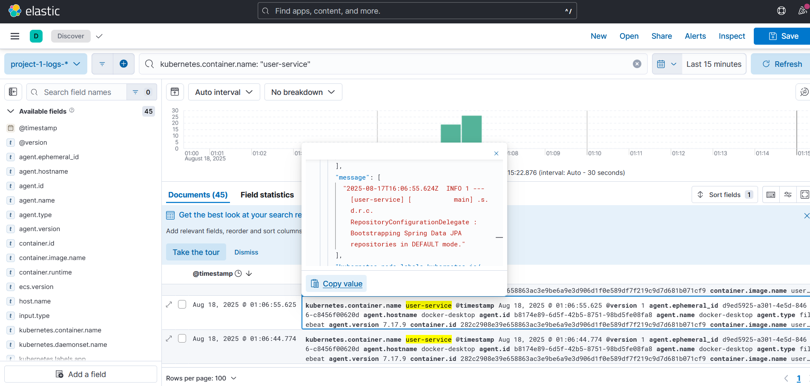

# Elasticsearch 로그 예시 - RAG_Example



```json
{
  "@timestamp": [
    "2025-08-17T16:07:02.242Z"
  ],
  "@version": [
    "1"
  ],
  "@version.keyword": [
    "1"
  ],
  "agent.ephemeral_id": [
    "d9ed5925-a301-4e5d-8466-c8456f00620d"
  ],
  "agent.ephemeral_id.keyword": [
    "d9ed5925-a301-4e5d-8466-c8456f00620d"
  ],
  "agent.hostname": [
    "docker-desktop"
  ],
  "agent.hostname.keyword": [
    "docker-desktop"
  ],
  "agent.id": [
    "b8174e89-6d5f-42b5-8751-98bd5fe08fa8"
  ],
  "agent.id.keyword": [
    "b8174e89-6d5f-42b5-8751-98bd5fe08fa8"
  ],
  "agent.name": [
    "docker-desktop"
  ],
  "agent.name.keyword": [
    "docker-desktop"
  ],
  "agent.type": [
    "filebeat"
  ],
  "agent.type.keyword": [
    "filebeat"
  ],
  "agent.version": [
    "7.17.9"
  ],
  "agent.version.keyword": [
    "7.17.9"
  ],
  "container.id": [
    "282c2908e39e658863ac3e9be6a9e3d906d1f0e589df7f219c9d7d681b071cf9"
  ],
  "container.id.keyword": [
    "282c2908e39e658863ac3e9be6a9e3d906d1f0e589df7f219c9d7d681b071cf9"
  ],
  "container.image.name": [
    "user-service:local"
  ],
  "container.image.name.keyword": [
    "user-service:local"
  ],
  "container.runtime": [
    "docker"
  ],
  "container.runtime.keyword": [
    "docker"
  ],
  "ecs.version": [
    "1.12.0"
  ],
  "ecs.version.keyword": [
    "1.12.0"
  ],
  "host.name": [
    "docker-desktop"
  ],
  "host.name.keyword": [
    "docker-desktop"
  ],
  "input.type": [
    "container"
  ],
  "input.type.keyword": [
    "container"
  ],
  "kubernetes.container.name": [
    "user-service"
  ],
  "kubernetes.container.name.keyword": [
    "user-service"
  ],
  "kubernetes.labels.app": [
    "user-service"
  ],
  "kubernetes.labels.app.keyword": [
    "user-service"
  ],
  "kubernetes.labels.pod-template-hash": [
    "94987b69"
  ],
  "kubernetes.labels.pod-template-hash.keyword": [
    "94987b69"
  ],
  "kubernetes.namespace": [
    "default"
  ],
  "kubernetes.namespace_labels.kubernetes_io/metadata_name": [
    "default"
  ],
  "kubernetes.namespace_labels.kubernetes_io/metadata_name.keyword": [
    "default"
  ],
  "kubernetes.namespace_uid": [
    "e922cb47-4e8a-4bd3-b5be-d5e9c8be7686"
  ],
  "kubernetes.namespace_uid.keyword": [
    "e922cb47-4e8a-4bd3-b5be-d5e9c8be7686"
  ],
  "kubernetes.namespace.keyword": [
    "default"
  ],
  "kubernetes.node.hostname": [
    "docker-desktop"
  ],
  "kubernetes.node.hostname.keyword": [
    "docker-desktop"
  ],
  "kubernetes.node.labels.beta_kubernetes_io/arch": [
    "amd64"
  ],
  "kubernetes.node.labels.beta_kubernetes_io/arch.keyword": [
    "amd64"
  ],
  "kubernetes.node.labels.beta_kubernetes_io/os": [
    "linux"
  ],
  "kubernetes.node.labels.beta_kubernetes_io/os.keyword": [
    "linux"
  ],
  "kubernetes.node.labels.kubernetes_io/arch": [
    "amd64"
  ],
  "kubernetes.node.labels.kubernetes_io/arch.keyword": [
    "amd64"
  ],
  "kubernetes.node.labels.kubernetes_io/hostname": [
    "docker-desktop"
  ],
  "kubernetes.node.labels.kubernetes_io/hostname.keyword": [
    "docker-desktop"
  ],
  "kubernetes.node.labels.kubernetes_io/os": [
    "linux"
  ],
  "kubernetes.node.labels.kubernetes_io/os.keyword": [
    "linux"
  ],
  "kubernetes.node.labels.node_kubernetes_io/exclude-from-external-load-balancers": [
    ""
  ],
  "kubernetes.node.labels.node_kubernetes_io/exclude-from-external-load-balancers.keyword": [
    ""
  ],
  "kubernetes.node.labels.node-role_kubernetes_io/control-plane": [
    ""
  ],
  "kubernetes.node.labels.node-role_kubernetes_io/control-plane.keyword": [
    ""
  ],
  "kubernetes.node.name": [
    "docker-desktop"
  ],
  "kubernetes.node.name.keyword": [
    "docker-desktop"
  ],
  "kubernetes.node.uid": [
    "295fb6b4-995d-450a-a7b6-3f9e07f30688"
  ],
  "kubernetes.node.uid.keyword": [
    "295fb6b4-995d-450a-a7b6-3f9e07f30688"
  ],
  "kubernetes.pod.ip": [
    "10.1.0.182"
  ],
  "kubernetes.pod.ip.keyword": [
    "10.1.0.182"
  ],
  "kubernetes.pod.name": [
    "user-service-deployment-94987b69-bqj6w"
  ],
  "kubernetes.pod.name.keyword": [
    "user-service-deployment-94987b69-bqj6w"
  ],
  "kubernetes.pod.uid": [
    "fb774510-d0dc-4309-8c20-b7d5a92be4d2"
  ],
  "kubernetes.pod.uid.keyword": [
    "fb774510-d0dc-4309-8c20-b7d5a92be4d2"
  ],
  "kubernetes.replicaset.name": [
    "user-service-deployment-94987b69"
  ],
  "kubernetes.replicaset.name.keyword": [
    "user-service-deployment-94987b69"
  ],
  "log.file.path": [
    "/var/lib/docker/containers/282c2908e39e658863ac3e9be6a9e3d906d1f0e589df7f219c9d7d681b071cf9/282c2908e39e658863ac3e9be6a9e3d906d1f0e589df7f219c9d7d681b071cf9-json.log"
  ],
  "log.file.path.keyword": [
    "/var/lib/docker/containers/282c2908e39e658863ac3e9be6a9e3d906d1f0e589df7f219c9d7d681b071cf9/282c2908e39e658863ac3e9be6a9e3d906d1f0e589df7f219c9d7d681b071cf9-json.log"
  ],
  "log.offset": [
    3669
  ],
  "message": [
    "2025-08-17T16:07:02.241Z  INFO 1 --- [user-service] [           main] o.h.c.internal.RegionFactoryInitiator    : HHH000026: Second-level cache disabled"
  ],
  "message.keyword": [
    "2025-08-17T16:07:02.241Z  INFO 1 --- [user-service] [           main] o.h.c.internal.RegionFactoryInitiator    : HHH000026: Second-level cache disabled"
  ],
  "stream": [
    "stdout"
  ],
  "stream.keyword": [
    "stdout"
  ],
  "tags": [
    "beats_input_codec_plain_applied"
  ],
  "tags.keyword": [
    "beats_input_codec_plain_applied"
  ],
  "_id": "1bHIuJgBNDbpy3frzR6G",
  "_index": "project-1-logs-%2025.08.17",
  "_score": null
}
```

```json
{
  "@timestamp": [
    "2025-08-17T16:06:44.015Z"
  ],
  "@version": [
    "1"
  ],
  "@version.keyword": [
    "1"
  ],
  "agent.ephemeral_id": [
    "d9ed5925-a301-4e5d-8466-c8456f00620d"
  ],
  "agent.ephemeral_id.keyword": [
    "d9ed5925-a301-4e5d-8466-c8456f00620d"
  ],
  "agent.hostname": [
    "docker-desktop"
  ],
  "agent.hostname.keyword": [
    "docker-desktop"
  ],
  "agent.id": [
    "b8174e89-6d5f-42b5-8751-98bd5fe08fa8"
  ],
  "agent.id.keyword": [
    "b8174e89-6d5f-42b5-8751-98bd5fe08fa8"
  ],
  "agent.name": [
    "docker-desktop"
  ],
  "agent.name.keyword": [
    "docker-desktop"
  ],
  "agent.type": [
    "filebeat"
  ],
  "agent.type.keyword": [
    "filebeat"
  ],
  "agent.version": [
    "7.17.9"
  ],
  "agent.version.keyword": [
    "7.17.9"
  ],
  "container.id": [
    "282c2908e39e658863ac3e9be6a9e3d906d1f0e589df7f219c9d7d681b071cf9"
  ],
  "container.id.keyword": [
    "282c2908e39e658863ac3e9be6a9e3d906d1f0e589df7f219c9d7d681b071cf9"
  ],
  "container.image.name": [
    "user-service:local"
  ],
  "container.image.name.keyword": [
    "user-service:local"
  ],
  "container.runtime": [
    "docker"
  ],
  "container.runtime.keyword": [
    "docker"
  ],
  "ecs.version": [
    "1.12.0"
  ],
  "ecs.version.keyword": [
    "1.12.0"
  ],
  "host.name": [
    "docker-desktop"
  ],
  "host.name.keyword": [
    "docker-desktop"
  ],
  "input.type": [
    "container"
  ],
  "input.type.keyword": [
    "container"
  ],
  "kubernetes.container.name": [
    "user-service"
  ],
  "kubernetes.container.name.keyword": [
    "user-service"
  ],
  "kubernetes.labels.app": [
    "user-service"
  ],
  "kubernetes.labels.app.keyword": [
    "user-service"
  ],
  "kubernetes.labels.pod-template-hash": [
    "94987b69"
  ],
  "kubernetes.labels.pod-template-hash.keyword": [
    "94987b69"
  ],
  "kubernetes.namespace": [
    "default"
  ],
  "kubernetes.namespace_labels.kubernetes_io/metadata_name": [
    "default"
  ],
  "kubernetes.namespace_labels.kubernetes_io/metadata_name.keyword": [
    "default"
  ],
  "kubernetes.namespace_uid": [
    "e922cb47-4e8a-4bd3-b5be-d5e9c8be7686"
  ],
  "kubernetes.namespace_uid.keyword": [
    "e922cb47-4e8a-4bd3-b5be-d5e9c8be7686"
  ],
  "kubernetes.namespace.keyword": [
    "default"
  ],
  "kubernetes.node.hostname": [
    "docker-desktop"
  ],
  "kubernetes.node.hostname.keyword": [
    "docker-desktop"
  ],
  "kubernetes.node.labels.beta_kubernetes_io/arch": [
    "amd64"
  ],
  "kubernetes.node.labels.beta_kubernetes_io/arch.keyword": [
    "amd64"
  ],
  "kubernetes.node.labels.beta_kubernetes_io/os": [
    "linux"
  ],
  "kubernetes.node.labels.beta_kubernetes_io/os.keyword": [
    "linux"
  ],
  "kubernetes.node.labels.kubernetes_io/arch": [
    "amd64"
  ],
  "kubernetes.node.labels.kubernetes_io/arch.keyword": [
    "amd64"
  ],
  "kubernetes.node.labels.kubernetes_io/hostname": [
    "docker-desktop"
  ],
  "kubernetes.node.labels.kubernetes_io/hostname.keyword": [
    "docker-desktop"
  ],
  "kubernetes.node.labels.kubernetes_io/os": [
    "linux"
  ],
  "kubernetes.node.labels.kubernetes_io/os.keyword": [
    "linux"
  ],
  "kubernetes.node.labels.node_kubernetes_io/exclude-from-external-load-balancers": [
    ""
  ],
  "kubernetes.node.labels.node_kubernetes_io/exclude-from-external-load-balancers.keyword": [
    ""
  ],
  "kubernetes.node.labels.node-role_kubernetes_io/control-plane": [
    ""
  ],
  "kubernetes.node.labels.node-role_kubernetes_io/control-plane.keyword": [
    ""
  ],
  "kubernetes.node.name": [
    "docker-desktop"
  ],
  "kubernetes.node.name.keyword": [
    "docker-desktop"
  ],
  "kubernetes.node.uid": [
    "295fb6b4-995d-450a-a7b6-3f9e07f30688"
  ],
  "kubernetes.node.uid.keyword": [
    "295fb6b4-995d-450a-a7b6-3f9e07f30688"
  ],
  "kubernetes.pod.ip": [
    "10.1.0.182"
  ],
  "kubernetes.pod.ip.keyword": [
    "10.1.0.182"
  ],
  "kubernetes.pod.name": [
    "user-service-deployment-94987b69-bqj6w"
  ],
  "kubernetes.pod.name.keyword": [
    "user-service-deployment-94987b69-bqj6w"
  ],
  "kubernetes.pod.uid": [
    "fb774510-d0dc-4309-8c20-b7d5a92be4d2"
  ],
  "kubernetes.pod.uid.keyword": [
    "fb774510-d0dc-4309-8c20-b7d5a92be4d2"
  ],
  "kubernetes.replicaset.name": [
    "user-service-deployment-94987b69"
  ],
  "kubernetes.replicaset.name.keyword": [
    "user-service-deployment-94987b69"
  ],
  "log.file.path": [
    "/var/lib/docker/containers/282c2908e39e658863ac3e9be6a9e3d906d1f0e589df7f219c9d7d681b071cf9/282c2908e39e658863ac3e9be6a9e3d906d1f0e589df7f219c9d7d681b071cf9-json.log"
  ],
  "log.file.path.keyword": [
    "/var/lib/docker/containers/282c2908e39e658863ac3e9be6a9e3d906d1f0e589df7f219c9d7d681b071cf9/282c2908e39e658863ac3e9be6a9e3d906d1f0e589df7f219c9d7d681b071cf9-json.log"
  ],
  "log.offset": [
    531
  ],
  "message": [
    "  '  |____| .__|_| |_|_| |_\\__, | / / / /"
  ],
  "message.keyword": [
    "  '  |____| .__|_| |_|_| |_\\__, | / / / /"
  ],
  "stream": [
    "stdout"
  ],
  "stream.keyword": [
    "stdout"
  ],
  "tags": [
    "beats_input_codec_plain_applied"
  ],
  "tags.keyword": [
    "beats_input_codec_plain_applied"
  ],
  "_id": "urHIuJgBNDbpy3frhxsv",
  "_index": "project-1-logs-%2025.08.17",
  "_score": null
}
```

```json
{
  "_index": "project-1-logs-%2025.08.17",
  "_id": "tbHIuJgBNDbpy3frhxse",
  "_version": 1,
  "_score": null,
  "fields": {
    "agent.version.keyword": [
      "7.17.9"
    ],
    "kubernetes.node.uid": [
      "295fb6b4-995d-450a-a7b6-3f9e07f30688"
    ],
    "kubernetes.namespace_uid.keyword": [
      "e922cb47-4e8a-4bd3-b5be-d5e9c8be7686"
    ],
    "host.name.keyword": [
      "docker-desktop"
    ],
    "kubernetes.namespace_uid": [
      "e922cb47-4e8a-4bd3-b5be-d5e9c8be7686"
    ],
    "kubernetes.node.labels.kubernetes_io/os": [
      "linux"
    ],
    "agent.hostname.keyword": [
      "docker-desktop"
    ],
    "container.id": [
      "282c2908e39e658863ac3e9be6a9e3d906d1f0e589df7f219c9d7d681b071cf9"
    ],
    "kubernetes.labels.pod-template-hash": [
      "94987b69"
    ],
    "kubernetes.node.labels.kubernetes_io/os.keyword": [
      "linux"
    ],
    "ecs.version.keyword": [
      "1.12.0"
    ],
    "container.image.name": [
      "user-service:local"
    ],
    "kubernetes.container.name.keyword": [
      "user-service"
    ],
    "kubernetes.labels.app": [
      "user-service"
    ],
    "kubernetes.namespace": [
      "default"
    ],
    "kubernetes.node.labels.beta_kubernetes_io/os": [
      "linux"
    ],
    "kubernetes.pod.name.keyword": [
      "user-service-deployment-94987b69-bqj6w"
    ],
    "agent.name": [
      "docker-desktop"
    ],
    "host.name": [
      "docker-desktop"
    ],
    "kubernetes.node.labels.kubernetes_io/hostname.keyword": [
      "docker-desktop"
    ],
    "agent.id.keyword": [
      "b8174e89-6d5f-42b5-8751-98bd5fe08fa8"
    ],
    "kubernetes.node.labels.node-role_kubernetes_io/control-plane.keyword": [
      ""
    ],
    "@version.keyword": [
      "1"
    ],
    "input.type": [
      "container"
    ],
    "kubernetes.node.uid.keyword": [
      "295fb6b4-995d-450a-a7b6-3f9e07f30688"
    ],
    "log.offset": [
      71
    ],
    "agent.hostname": [
      "docker-desktop"
    ],
    "tags": [
      "beats_input_codec_plain_applied"
    ],
    "container.runtime": [
      "docker"
    ],
    "agent.id": [
      "b8174e89-6d5f-42b5-8751-98bd5fe08fa8"
    ],
    "ecs.version": [
      "1.12.0"
    ],
    "message.keyword": [
      "  .   ____          _            __ _ _"
    ],
    "kubernetes.node.labels.node-role_kubernetes_io/control-plane": [
      ""
    ],
    "agent.version": [
      "7.17.9"
    ],
    "kubernetes.namespace.keyword": [
      "default"
    ],
    "kubernetes.node.name": [
      "docker-desktop"
    ],
    "input.type.keyword": [
      "container"
    ],
    "stream.keyword": [
      "stdout"
    ],
    "kubernetes.node.hostname": [
      "docker-desktop"
    ],
    "tags.keyword": [
      "beats_input_codec_plain_applied"
    ],
    "kubernetes.node.name.keyword": [
      "docker-desktop"
    ],
    "kubernetes.pod.uid": [
      "fb774510-d0dc-4309-8c20-b7d5a92be4d2"
    ],
    "kubernetes.node.hostname.keyword": [
      "docker-desktop"
    ],
    "agent.type": [
      "filebeat"
    ],
    "stream": [
      "stdout"
    ],
    "kubernetes.labels.app.keyword": [
      "user-service"
    ],
    "kubernetes.node.labels.kubernetes_io/arch.keyword": [
      "amd64"
    ],
    "@version": [
      "1"
    ],
    "kubernetes.pod.name": [
      "user-service-deployment-94987b69-bqj6w"
    ],
    "container.image.name.keyword": [
      "user-service:local"
    ],
    "log.file.path.keyword": [
      "/var/lib/docker/containers/282c2908e39e658863ac3e9be6a9e3d906d1f0e589df7f219c9d7d681b071cf9/282c2908e39e658863ac3e9be6a9e3d906d1f0e589df7f219c9d7d681b071cf9-json.log"
    ],
    "agent.type.keyword": [
      "filebeat"
    ],
    "kubernetes.pod.ip": [
      "10.1.0.182"
    ],
    "agent.ephemeral_id.keyword": [
      "d9ed5925-a301-4e5d-8466-c8456f00620d"
    ],
    "kubernetes.container.name": [
      "user-service"
    ],
    "kubernetes.labels.pod-template-hash.keyword": [
      "94987b69"
    ],
    "agent.name.keyword": [
      "docker-desktop"
    ],
    "kubernetes.node.labels.beta_kubernetes_io/arch.keyword": [
      "amd64"
    ],
    "kubernetes.replicaset.name": [
      "user-service-deployment-94987b69"
    ],
    "kubernetes.namespace_labels.kubernetes_io/metadata_name": [
      "default"
    ],
    "message": [
      "  .   ____          _            __ _ _"
    ],
    "kubernetes.node.labels.kubernetes_io/hostname": [
      "docker-desktop"
    ],
    "kubernetes.node.labels.beta_kubernetes_io/arch": [
      "amd64"
    ],
    "@timestamp": [
      "2025-08-17T16:06:44.015Z"
    ],
    "kubernetes.pod.uid.keyword": [
      "fb774510-d0dc-4309-8c20-b7d5a92be4d2"
    ],
    "kubernetes.replicaset.name.keyword": [
      "user-service-deployment-94987b69"
    ],
    "container.runtime.keyword": [
      "docker"
    ],
    "kubernetes.namespace_labels.kubernetes_io/metadata_name.keyword": [
      "default"
    ],
    "kubernetes.node.labels.node_kubernetes_io/exclude-from-external-load-balancers.keyword": [
      ""
    ],
    "log.file.path": [
      "/var/lib/docker/containers/282c2908e39e658863ac3e9be6a9e3d906d1f0e589df7f219c9d7d681b071cf9/282c2908e39e658863ac3e9be6a9e3d906d1f0e589df7f219c9d7d681b071cf9-json.log"
    ],
    "agent.ephemeral_id": [
      "d9ed5925-a301-4e5d-8466-c8456f00620d"
    ],
    "kubernetes.node.labels.kubernetes_io/arch": [
      "amd64"
    ],
    "container.id.keyword": [
      "282c2908e39e658863ac3e9be6a9e3d906d1f0e589df7f219c9d7d681b071cf9"
    ],
    "kubernetes.node.labels.beta_kubernetes_io/os.keyword": [
      "linux"
    ],
    "kubernetes.node.labels.node_kubernetes_io/exclude-from-external-load-balancers": [
      ""
    ],
    "kubernetes.pod.ip.keyword": [
      "10.1.0.182"
    ]
  },
  "highlight": {
    "kubernetes.container.name": [
      "@kibana-highlighted-field@user-service@/kibana-highlighted-field@"
    ]
  },
  "sort": [
    "2025-08-17T16:06:44.015Z",
    936293
  ]
}
```

```json
{
  "@timestamp": [
    "2025-08-17T16:06:44.018Z"
  ],
  "@version": [
    "1"
  ],
  "@version.keyword": [
    "1"
  ],
  "agent.ephemeral_id": [
    "d9ed5925-a301-4e5d-8466-c8456f00620d"
  ],
  "agent.ephemeral_id.keyword": [
    "d9ed5925-a301-4e5d-8466-c8456f00620d"
  ],
  "agent.hostname": [
    "docker-desktop"
  ],
  "agent.hostname.keyword": [
    "docker-desktop"
  ],
  "agent.id": [
    "b8174e89-6d5f-42b5-8751-98bd5fe08fa8"
  ],
  "agent.id.keyword": [
    "b8174e89-6d5f-42b5-8751-98bd5fe08fa8"
  ],
  "agent.name": [
    "docker-desktop"
  ],
  "agent.name.keyword": [
    "docker-desktop"
  ],
  "agent.type": [
    "filebeat"
  ],
  "agent.type.keyword": [
    "filebeat"
  ],
  "agent.version": [
    "7.17.9"
  ],
  "agent.version.keyword": [
    "7.17.9"
  ],
  "container.id": [
    "282c2908e39e658863ac3e9be6a9e3d906d1f0e589df7f219c9d7d681b071cf9"
  ],
  "container.id.keyword": [
    "282c2908e39e658863ac3e9be6a9e3d906d1f0e589df7f219c9d7d681b071cf9"
  ],
  "container.image.name": [
    "user-service:local"
  ],
  "container.image.name.keyword": [
    "user-service:local"
  ],
  "container.runtime": [
    "docker"
  ],
  "container.runtime.keyword": [
    "docker"
  ],
  "ecs.version": [
    "1.12.0"
  ],
  "ecs.version.keyword": [
    "1.12.0"
  ],
  "host.name": [
    "docker-desktop"
  ],
  "host.name.keyword": [
    "docker-desktop"
  ],
  "input.type": [
    "container"
  ],
  "input.type.keyword": [
    "container"
  ],
  "kubernetes.container.name": [
    "user-service"
  ],
  "kubernetes.container.name.keyword": [
    "user-service"
  ],
  "kubernetes.labels.app": [
    "user-service"
  ],
  "kubernetes.labels.app.keyword": [
    "user-service"
  ],
  "kubernetes.labels.pod-template-hash": [
    "94987b69"
  ],
  "kubernetes.labels.pod-template-hash.keyword": [
    "94987b69"
  ],
  "kubernetes.namespace": [
    "default"
  ],
  "kubernetes.namespace_labels.kubernetes_io/metadata_name": [
    "default"
  ],
  "kubernetes.namespace_labels.kubernetes_io/metadata_name.keyword": [
    "default"
  ],
  "kubernetes.namespace_uid": [
    "e922cb47-4e8a-4bd3-b5be-d5e9c8be7686"
  ],
  "kubernetes.namespace_uid.keyword": [
    "e922cb47-4e8a-4bd3-b5be-d5e9c8be7686"
  ],
  "kubernetes.namespace.keyword": [
    "default"
  ],
  "kubernetes.node.hostname": [
    "docker-desktop"
  ],
  "kubernetes.node.hostname.keyword": [
    "docker-desktop"
  ],
  "kubernetes.node.labels.beta_kubernetes_io/arch": [
    "amd64"
  ],
  "kubernetes.node.labels.beta_kubernetes_io/arch.keyword": [
    "amd64"
  ],
  "kubernetes.node.labels.beta_kubernetes_io/os": [
    "linux"
  ],
  "kubernetes.node.labels.beta_kubernetes_io/os.keyword": [
    "linux"
  ],
  "kubernetes.node.labels.kubernetes_io/arch": [
    "amd64"
  ],
  "kubernetes.node.labels.kubernetes_io/arch.keyword": [
    "amd64"
  ],
  "kubernetes.node.labels.kubernetes_io/hostname": [
    "docker-desktop"
  ],
  "kubernetes.node.labels.kubernetes_io/hostname.keyword": [
    "docker-desktop"
  ],
  "kubernetes.node.labels.kubernetes_io/os": [
    "linux"
  ],
  "kubernetes.node.labels.kubernetes_io/os.keyword": [
    "linux"
  ],
  "kubernetes.node.labels.node_kubernetes_io/exclude-from-external-load-balancers": [
    ""
  ],
  "kubernetes.node.labels.node_kubernetes_io/exclude-from-external-load-balancers.keyword": [
    ""
  ],
  "kubernetes.node.labels.node-role_kubernetes_io/control-plane": [
    ""
  ],
  "kubernetes.node.labels.node-role_kubernetes_io/control-plane.keyword": [
    ""
  ],
  "kubernetes.node.name": [
    "docker-desktop"
  ],
  "kubernetes.node.name.keyword": [
    "docker-desktop"
  ],
  "kubernetes.node.uid": [
    "295fb6b4-995d-450a-a7b6-3f9e07f30688"
  ],
  "kubernetes.node.uid.keyword": [
    "295fb6b4-995d-450a-a7b6-3f9e07f30688"
  ],
  "kubernetes.pod.ip": [
    "10.1.0.182"
  ],
  "kubernetes.pod.ip.keyword": [
    "10.1.0.182"
  ],
  "kubernetes.pod.name": [
    "user-service-deployment-94987b69-bqj6w"
  ],
  "kubernetes.pod.name.keyword": [
    "user-service-deployment-94987b69-bqj6w"
  ],
  "kubernetes.pod.uid": [
    "fb774510-d0dc-4309-8c20-b7d5a92be4d2"
  ],
  "kubernetes.pod.uid.keyword": [
    "fb774510-d0dc-4309-8c20-b7d5a92be4d2"
  ],
  "kubernetes.replicaset.name": [
    "user-service-deployment-94987b69"
  ],
  "kubernetes.replicaset.name.keyword": [
    "user-service-deployment-94987b69"
  ],
  "log.file.path": [
    "/var/lib/docker/containers/282c2908e39e658863ac3e9be6a9e3d906d1f0e589df7f219c9d7d681b071cf9/282c2908e39e658863ac3e9be6a9e3d906d1f0e589df7f219c9d7d681b071cf9-json.log"
  ],
  "log.file.path.keyword": [
    "/var/lib/docker/containers/282c2908e39e658863ac3e9be6a9e3d906d1f0e589df7f219c9d7d681b071cf9/282c2908e39e658863ac3e9be6a9e3d906d1f0e589df7f219c9d7d681b071cf9-json.log"
  ],
  "log.offset": [
    826
  ],
  "message": [
    " :: Spring Boot ::                (v3.5.0)"
  ],
  "message.keyword": [
    " :: Spring Boot ::                (v3.5.0)"
  ],
  "stream": [
    "stdout"
  ],
  "stream.keyword": [
    "stdout"
  ],
  "tags": [
    "beats_input_codec_plain_applied"
  ],
  "tags.keyword": [
    "beats_input_codec_plain_applied"
  ],
  "_id": "hLHIuJgBNDbpy3frhxsP",
  "_index": "project-1-logs-%2025.08.17",
  "_score": null
}
```

```json
{
  "@timestamp": [
    "2025-08-17T16:06:55.625Z"
  ],
  "@version": [
    "1"
  ],
  "@version.keyword": [
    "1"
  ],
  "agent.ephemeral_id": [
    "d9ed5925-a301-4e5d-8466-c8456f00620d"
  ],
  "agent.ephemeral_id.keyword": [
    "d9ed5925-a301-4e5d-8466-c8456f00620d"
  ],
  "agent.hostname": [
    "docker-desktop"
  ],
  "agent.hostname.keyword": [
    "docker-desktop"
  ],
  "agent.id": [
    "b8174e89-6d5f-42b5-8751-98bd5fe08fa8"
  ],
  "agent.id.keyword": [
    "b8174e89-6d5f-42b5-8751-98bd5fe08fa8"
  ],
  "agent.name": [
    "docker-desktop"
  ],
  "agent.name.keyword": [
    "docker-desktop"
  ],
  "agent.type": [
    "filebeat"
  ],
  "agent.type.keyword": [
    "filebeat"
  ],
  "agent.version": [
    "7.17.9"
  ],
  "agent.version.keyword": [
    "7.17.9"
  ],
  "container.id": [
    "282c2908e39e658863ac3e9be6a9e3d906d1f0e589df7f219c9d7d681b071cf9"
  ],
  "container.id.keyword": [
    "282c2908e39e658863ac3e9be6a9e3d906d1f0e589df7f219c9d7d681b071cf9"
  ],
  "container.image.name": [
    "user-service:local"
  ],
  "container.image.name.keyword": [
    "user-service:local"
  ],
  "container.runtime": [
    "docker"
  ],
  "container.runtime.keyword": [
    "docker"
  ],
  "ecs.version": [
    "1.12.0"
  ],
  "ecs.version.keyword": [
    "1.12.0"
  ],
  "host.name": [
    "docker-desktop"
  ],
  "host.name.keyword": [
    "docker-desktop"
  ],
  "input.type": [
    "container"
  ],
  "input.type.keyword": [
    "container"
  ],
  "kubernetes.container.name": [
    "user-service"
  ],
  "kubernetes.container.name.keyword": [
    "user-service"
  ],
  "kubernetes.labels.app": [
    "user-service"
  ],
  "kubernetes.labels.app.keyword": [
    "user-service"
  ],
  "kubernetes.labels.pod-template-hash": [
    "94987b69"
  ],
  "kubernetes.labels.pod-template-hash.keyword": [
    "94987b69"
  ],
  "kubernetes.namespace": [
    "default"
  ],
  "kubernetes.namespace_labels.kubernetes_io/metadata_name": [
    "default"
  ],
  "kubernetes.namespace_labels.kubernetes_io/metadata_name.keyword": [
    "default"
  ],
  "kubernetes.namespace_uid": [
    "e922cb47-4e8a-4bd3-b5be-d5e9c8be7686"
  ],
  "kubernetes.namespace_uid.keyword": [
    "e922cb47-4e8a-4bd3-b5be-d5e9c8be7686"
  ],
  "kubernetes.namespace.keyword": [
    "default"
  ],
  "kubernetes.node.hostname": [
    "docker-desktop"
  ],
  "kubernetes.node.hostname.keyword": [
    "docker-desktop"
  ],
  "kubernetes.node.labels.beta_kubernetes_io/arch": [
    "amd64"
  ],
  "kubernetes.node.labels.beta_kubernetes_io/arch.keyword": [
    "amd64"
  ],
  "kubernetes.node.labels.beta_kubernetes_io/os": [
    "linux"
  ],
  "kubernetes.node.labels.beta_kubernetes_io/os.keyword": [
    "linux"
  ],
  "kubernetes.node.labels.kubernetes_io/arch": [
    "amd64"
  ],
  "kubernetes.node.labels.kubernetes_io/arch.keyword": [
    "amd64"
  ],
  "kubernetes.node.labels.kubernetes_io/hostname": [
    "docker-desktop"
  ],
  "kubernetes.node.labels.kubernetes_io/hostname.keyword": [
    "docker-desktop"
  ],
  "kubernetes.node.labels.kubernetes_io/os": [
    "linux"
  ],
  "kubernetes.node.labels.kubernetes_io/os.keyword": [
    "linux"
  ],
  "kubernetes.node.labels.node_kubernetes_io/exclude-from-external-load-balancers": [
    ""
  ],
  "kubernetes.node.labels.node_kubernetes_io/exclude-from-external-load-balancers.keyword": [
    ""
  ],
  "kubernetes.node.labels.node-role_kubernetes_io/control-plane": [
    ""
  ],
  "kubernetes.node.labels.node-role_kubernetes_io/control-plane.keyword": [
    ""
  ],
  "kubernetes.node.name": [
    "docker-desktop"
  ],
  "kubernetes.node.name.keyword": [
    "docker-desktop"
  ],
  "kubernetes.node.uid": [
    "295fb6b4-995d-450a-a7b6-3f9e07f30688"
  ],
  "kubernetes.node.uid.keyword": [
    "295fb6b4-995d-450a-a7b6-3f9e07f30688"
  ],
  "kubernetes.pod.ip": [
    "10.1.0.182"
  ],
  "kubernetes.pod.ip.keyword": [
    "10.1.0.182"
  ],
  "kubernetes.pod.name": [
    "user-service-deployment-94987b69-bqj6w"
  ],
  "kubernetes.pod.name.keyword": [
    "user-service-deployment-94987b69-bqj6w"
  ],
  "kubernetes.pod.uid": [
    "fb774510-d0dc-4309-8c20-b7d5a92be4d2"
  ],
  "kubernetes.pod.uid.keyword": [
    "fb774510-d0dc-4309-8c20-b7d5a92be4d2"
  ],
  "kubernetes.replicaset.name": [
    "user-service-deployment-94987b69"
  ],
  "kubernetes.replicaset.name.keyword": [
    "user-service-deployment-94987b69"
  ],
  "log.file.path": [
    "/var/lib/docker/containers/282c2908e39e658863ac3e9be6a9e3d906d1f0e589df7f219c9d7d681b071cf9/282c2908e39e658863ac3e9be6a9e3d906d1f0e589df7f219c9d7d681b071cf9-json.log"
  ],
  "log.file.path.keyword": [
    "/var/lib/docker/containers/282c2908e39e658863ac3e9be6a9e3d906d1f0e589df7f219c9d7d681b071cf9/282c2908e39e658863ac3e9be6a9e3d906d1f0e589df7f219c9d7d681b071cf9-json.log"
  ],
  "log.offset": [
    1535
  ],
  "message": [
    "2025-08-17T16:06:55.624Z  INFO 1 --- [user-service] [           main] .s.d.r.c.RepositoryConfigurationDelegate : Bootstrapping Spring Data JPA repositories in DEFAULT mode."
  ],
  "message.keyword": [
    "2025-08-17T16:06:55.624Z  INFO 1 --- [user-service] [           main] .s.d.r.c.RepositoryConfigurationDelegate : Bootstrapping Spring Data JPA repositories in DEFAULT mode."
  ],
  "stream": [
    "stdout"
  ],
  "stream.keyword": [
    "stdout"
  ],
  "tags": [
    "beats_input_codec_plain_applied"
  ],
  "tags.keyword": [
    "beats_input_codec_plain_applied"
  ],
  "_id": "lrHIuJgBNDbpy3fryR6q",
  "_index": "project-1-logs-%2025.08.17",
  "_score": null
}
```