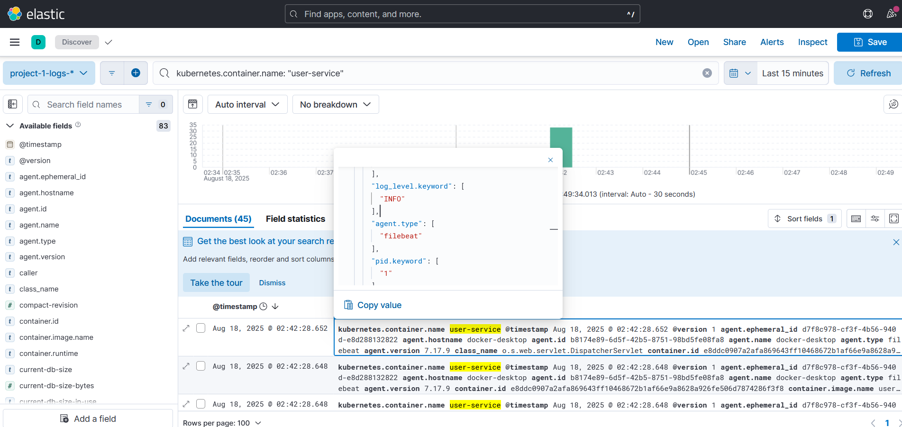

# Logstash의 grok 필터로 파싱하기

> 필터 기능을 사용하지 않는 경우, 로그가 단순한 긴 문자열로 표시됩니다.

- "로그 레벨이 ERROR인 로그만 찾기", "특정 클래스에서 발생한 로그만 조회하기" 등의 검색 기능을 사용하기 위해서 Logstash의 grok 필터를 사용해 볼 수 있습니다.

```
    filter {
      # 1. Spring Boot 로그인지 확인 (컨테이너 이름에 'service'가 포함된 경우)
      if "service" in [kubernetes][container][name] {
        grok {
          match => { "message" => "%{TIMESTAMP_ISO8601:log_timestamp}\s+%{LOGLEVEL:log_level}\s+%{NUMBER:pid}\s+---\s+\[%{DATA:service_name}\]\s+\[\s*%{DATA:thread_name}\]\s+%{JAVACLASS:class_name}\s+:\s+%{GREEDYDATA:log_message}" }
          # 파싱 성공 시 태그 추가
          add_tag => [ "grok_parsed_spring" ]
        }
        date {
          match => [ "log_timestamp", "ISO8601" ]
          target => "@timestamp"
        }
      }
      # 2. 다른 종류의 로그(예: Nginx)를 위한 파싱 규칙을 여기에 추가할 수 있습니다.
      # else if [kubernetes][container][name] == "nginx" {
      #   grok {
      #     match => { "message" => "%{IPORHOST:clientip} %{USER:ident} %{USER:auth} \[%{HTTPDATE:timestamp}\] \"%{WORD:verb} %{URIPATHPARAM:request} HTTP/%{NUMBER:httpversion}\" %{NUMBER:response:int} %{NUMBER:bytes:int}" }
      #     add_tag => [ "grok_parsed_nginx" ]
      #   }
      # }
      
      # 3. 위 조건에 맞지 않는 로그는 JSON 형식으로 파싱 시도 (범용적인 처리)
      else {
        json {
          source => "message"
          # JSON 파싱 성공 시 태그 추가
          add_tag => [ "json_parsed" ]
        }
      }

      # 파싱에 성공했다면(grok 또는 json), 원래의 긴 message 필드는 삭제
      if "grok_parsed_spring" in [tags] or "grok_parsed_nginx" in [tags] or "json_parsed" in [tags] {
        mutate {
          remove_field => ["message"]
        }
      }
    }
```
## grok 필터 적용



사진 상으로는 로그 전체가 보이지는 않지만, 이전 로그와 비교해 보면 차이점을 알 수 있습니다.

1. 새로운 필드 생성
이전에는 단순히 message 필드 안에 모든 정보가 통째로 들어있었지만, 이제는 grok 필터가 로그를 분해해서 아래와 같이 의미 있는 새 필드들을 만들어 줬습니다.

- log_level: "INFO"

- service_name: "user-service"

- class_name: "o.s.web.servlet.DispatcherServlet"

- log_message: "Completed initialization in 3 ms"

2. message 필드 삭제
Canvas에 설정한 대로, 파싱에 성공했기 때문에 원본 message 필드가 깔끔하게 삭제되었습니다.